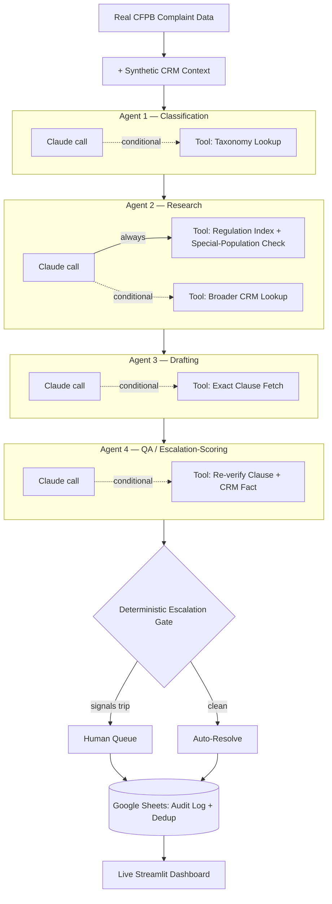

# Complaint Triage Orchestrator (S2.3)

A workflow automation + multi-agent AI orchestration pilot: real CFPB complaint data,
real federal regulation text, a disclosed synthetic CRM layer, and four Claude-powered
conditional-tool-use decision agents — orchestrated in n8n via direct Anthropic API
calls, not n8n's LangChain AI Agent nodes (see "Why a plain HTTP Request node" below
for why) — feeding a deterministic escalation gate. Full spec:
`../Docs/Complaint_Triage_Orchestrator_Spec.md`.

**Status: every phase in the spec is complete**, including the real per-ticket timing
measurement (below). See Section 15 of the spec for the full phase list, and "Phase 7
— the mock-to-real Claude API swap" below for exactly what was done, what broke, and
how it was fixed. (Phase 4's escalation gate was built during Phase 3 — see that
section below.)

**Live dashboard, reading the real Google Sheet on every page load:**
**[complaint-triage-orchestrator...streamlit.app](https://complaint-triage-orchestrator-2v8axupydgbjue7scerxww.streamlit.app/)**

## What this is

**The problem.** Classifying a complaint, researching the applicable regulation,
drafting a response, and assessing risk are repetitive but high-stakes tasks — get the
citation wrong, miss a special-population flag, or auto-send a response that
shouldn't have gone out, and the failure mode isn't "bad output," it's compliance
exposure. Blindly automating that with an LLM is unsafe; refusing to automate any of it
wastes the parts that genuinely are repetitive.

**What was built.** A four-stage AI decision pipeline in n8n: Claude classifies the
complaint, researches the applicable regulation, drafts a response, then QA-checks its
own citation and confidence — each stage conditionally reaching for a deterministic
tool (a taxonomy lookup, a regulation-text fetch, a CRM read) only when the case
actually calls for it (see "Conditional tool-use" below). All four stages feed a
**deterministic escalation gate** — explicitly not a fifth AI call, but plain code
compounding several independent signals (confidence, risk category, complaint history,
account value, stated monetary exposure) into a hard route: auto-resolve, or human
queue.

**What makes it different:** AI handles interpretation. Deterministic code handles
evidence, escalation, and audit.



**What's actually real here, not simulated:**
- Real CFPB complaint data, fetched live from the public Consumer Complaint Database API
- Real federal regulation text (FDCPA, FCRA, Regulation Z), sourced verbatim from Cornell LII/CFPB
- Real Claude API calls for all four agents — not mocked, not templated
- Real n8n execution, including a genuine autonomous trigger-fired run, not just manual step-through
- Real Google Sheets persistence, with working Append-or-Update deduplication
- The live Streamlit dashboard linked above, reading that same real Sheet on every page load
- A real, measured processing-time comparison (below)

Only the CRM layer is synthetic, and it's disclosed as such everywhere it appears —
never presented as real customer data (see Section 3c/12 in the spec).

**First real production measurement:** 16.8s automated end-to-end processing vs. the
sourced ~10 min manual baseline — **9.7 minutes saved per ticket, a 97% reduction.**
*n=1 — one real timed run, not yet an average. See "Phase 7" below for the full
methodology, including a Google Sheets credential that expired mid-run, recovered by
pulling the already-computed decision out of the failed execution's own stored data
rather than paying for it twice.*

**What broke, for real, along the way:** an n8n HTTP Request node silently replacing an
item's data instead of merging it, corrupting what downstream agents received; a
genuinely missing canvas connection that only diffing live API state against source
JSON caught; a watermark that could never actually advance because two nodes were
reading and writing two different storage scopes. The build history below documents
these as they happened, not cleaned up in retrospect.

### Why this matters

This project demonstrates how I approach AI automation in operational environments:
use LLMs for interpretation, deterministic logic for control, grounded real data for
evidence, and human escalation wherever risk remains — then measure whether it
actually worked, and say so plainly when a number (like 17% escalation agreement,
below) looks worse than it is and needs explaining rather than hiding.

## Documentation verification

Every data, taxonomy, and regulatory-citation claim in the spec has been reconciled
against live sources — including a near-miss where a first search pass, using
Elasticsearch pagination on a field with many tied timestamps, produced a false
negative before a tighter query found the record. See
[`docs/verification-notes.md`](docs/verification-notes.md) for the full chronology:
what was checked, what a false negative looked like and how it was caught, and the
one real discrepancy found and fixed in the spec text itself. Recorded rather than
silently corrected — the same "disclose it, don't hide it" principle as everything
else in this README.

## Phase 1 — access, trigger, reference data

- [`n8n/workflows/complaint_triage_orchestrator.json`](n8n/workflows/complaint_triage_orchestrator.json)
  — dual trigger (Schedule every 15 min + Manual), watermark-based fetch against the
  live CFPB Consumer Complaint Database API, capped at 25 complaints/run, scoped to the
  pilot's two products (Debt collection, Credit card).
- [`reference_data/taxonomy/cfpb_taxonomy.json`](reference_data/taxonomy/cfpb_taxonomy.json)
  — the CFPB's own product/issue/sub-issue tree, scoped to the pilot, pulled live and
  cached. Backs Agent 1's taxonomy lookup tool (spec Section 6).
- [`reference_data/regulations/`](reference_data/regulations/) — five static reference
  files with verbatim federal statute/regulation text (FDCPA §1692g, §1692e; FCRA
  §1681c-2; Regulation Z §1026.13; CFPB's 15-day company-response rule), sourced from
  Cornell LII and CFPB directly (spec Section 3b).
- [`scripts/fetch_taxonomy.py`](scripts/fetch_taxonomy.py),
  [`scripts/fetch_regulations.py`](scripts/fetch_regulations.py) — the sourcing scripts
  that generated the two reference-data sets above. Both hit public, unauthenticated
  endpoints (no API key anywhere in this project) and are safe to re-run to refresh a
  cached snapshot.

**Read [`reference_data/README.md`](reference_data/README.md) before Phase 2** — it
documents a real discrepancy found between the spec's Section 6 taxonomy claim and the
live CFPB data pulled during this phase.

### Workflow logic, as built

1. **Schedule Trigger** (15 min) or **Manual Trigger** → both feed **Get Watermark**.
2. **Get Watermark** (Code node) reads `lastWatermarkDate` from n8n workflow static
   data. First run only: falls back to `today − 30 days`, not `today − 1 day` — CFPB
   only publishes a complaint once the company has responded or 15 days have passed
   (the 15-day rule itself, cached in this same phase), so a 1-day lookback would
   mostly return nothing on a fresh workflow.
3. **CFPB Complaint Search** (HTTP Request) — `GET` against
   `consumerfinance.gov/data-research/consumer-complaints/search/api/v1/` with
   `product=Debt collection`, `product=Credit card` (confirmed live: repeated params
   OR, not the last one winning), `date_received_min=<watermark>`, `size=25`,
   `sort=created_date_asc`, `no_aggs=true`.
4. **Cap Batch & Advance Watermark** (Code node) — defensive second cap at 25,
   flattens each Elasticsearch hit down to the spec's Section 3a fields, and advances
   `lastWatermarkDate` to the latest `date_received` actually seen.

Phase 1 stops at step 4's output: a capped, flattened batch of tickets.

5. **Generate Synthetic CRM Record** (Code node) — adds a `crm` object per ticket per
   the Section 3c schema. Deterministic: seeded from `complaint_id` (mulberry32 PRNG),
   so re-processing the same ticket always yields the same synthetic record instead of
   a new random one each run — important given the watermark overlap noted below can
   legitimately hand the same ticket to this node more than once. Every `crm` field is
   synthetic **except** `linked_complaint_id` (the real CFPB complaint ID) and
   `servicemember_flag` / `special_population_flag`, which carry forward CFPB's own
   real `tags` field where present (`"Servicemember"`, `"Older American"`, or both) —
   the hybrid rule from spec Section 3c/12. No agents, no escalation gate, no storage
   yet — those are Phases 3–7.

### Phase 2 design note: the generator vs. the Section 6 fixtures

This generator produces synthetic data for whatever real tickets Phase 1 fetches live
— it does **not** try to reproduce the exact CRM values in spec Section 6's worked
Ticket A/B/C table (tenure 6/1/3yrs, 1/1/2 products, $2,340/$0/$0 balance). Those three
are fixed fixtures for Phase 3's mock-agent testing, from a fixed historical CFPB
snapshot (complaint IDs in the 9999970s) that a live poll today won't encounter — Phase
3 will hardcode them directly rather than asking this generator to special-case three
IDs. Same schema either way, so the fixtures stay a drop-in match for what production
data will actually look like once the mock-to-real swap happens (Section 15 Phase 7).

`special_population_flag` folds in the Servicemember tag, not just Older American —
confirmed as intended in spec v5, which also formalizes the consequence: Agent 2's CRM
lookup tool (Phase 3, not yet built) must always populate `special_population_flag` on
every ticket regardless of whether the broader CRM-context lookup (tenure, balance,
prior-complaint history) runs. Nothing changes here in Phase 2 — this generator already
computes the flag unconditionally on every synthetic CRM record, independent of any
downstream agent's decision to use the rest of the record. What v5 adds is a Phase 3
requirement: Agent 2's tool interface and output schema need to expose the flag on its
own (`special_population_flag: bool`, not folded into free-text `customer_context`),
separately from the discretionary broader lookup — see spec Section 6's structured
hand-off schema and the twelve updated fixtures.

### A build-time finding worth flagging before Phase 2

CFPB's `date_received_min` filter only accepts date granularity (`YYYY-MM-DD`) — the
live API rejects sub-day timestamps (confirmed by testing, not assumed). That means a
same-day poll can legitimately re-return complaints already fetched earlier that day.
This workflow does **not** dedup here — by design, per spec Section 11, dedup-by-complaint-ID
belongs to the storage layer (Google Sheets Append-or-Update). **Resolved:** see
"Storage and dedup" below — no longer an open gap.

### How to import into n8n

1. In n8n: **Workflows → Import from File** → select
   `n8n/workflows/complaint_triage_orchestrator.json`.
2. No credentials required — the CFPB API is public and unauthenticated.
3. Run **Manual Trigger** once to test end-to-end before activating the schedule.

**Re-importing into an existing installation (e.g. after the Merge-node retrofit
below):** n8n's Import from File/URL *pastes into the current canvas* rather than
replacing it — importing on top of an already-populated workflow duplicates every
node instead of updating it in place. To pick up structural changes safely:
1. Create a brand-new, empty workflow in n8n.
2. Import the updated JSON into that empty canvas (no duplication risk — nothing to
   collide with).
3. Re-attach the real Google Sheets credential to the "Google Sheets: Log Decision"
   node — credentials aren't part of the exported JSON (deliberately, see "Storage
   and dedup" below), so this one step has to happen by hand in the UI regardless of
   import method.
4. Once verified, delete or archive the old workflow.

### Verified during this phase, against the live API (not assumed from docs)

- Base endpoint returns Elasticsearch-shaped JSON directly (no `/complaints` sub-path).
- Repeated `product=` query params act as an OR filter, not last-value-wins.
- `date_received_min` requires `YYYY-MM-DD`; sub-day timestamps 400.
- `no_aggs=true` drops the (large) `aggregations` block from the response.
- `issue` → `sub_issue.raw` nested aggregation buckets exist and are un-truncated for
  the pilot's two products (confirmed `sum_other_doc_count: 0`), so the cached taxonomy
  file is complete, not a sample.

## Phase 3 — four agents, mock-first, plus the escalation gate

Spec Section 15 groups the escalation gate into the same Phase 3 verification pass as
the agents ("Build and debug the full orchestration, tool-use branching, and escalation
gate against known-good fixture data") — you can't validate end-to-end orchestration
without it, so it's built here rather than held back for Phase 4. Flagging that
explicitly rather than quietly declaring Phase 4 done without saying so.

**How this is built, and why:** every Code node's logic is a real, tested JS function
defined once in [`scripts/build_workflow.js`](scripts/build_workflow.js), unit-tested
against the three spec fixtures (plus a negative control) in that same script's
self-test section, then embedded into the n8n workflow JSON via
`Function.prototype.toString()`. The code that's tested and the code that ships inside
the workflow are byte-identical — no hand-retyping into a JSON string, no risk of the
two drifting apart. The script refuses to write the workflow file if any assertion
fails. Re-run it any time with:

```bash
node scripts/build_workflow.js
```

It owns and idempotently regenerates every Phase 3 node/connection; Phase 1/2 nodes are
left untouched.

**Verification beyond the self-test:** [`scripts/simulate_workflow.mjs`](scripts/simulate_workflow.mjs)
is a minimal n8n execution simulator — it loads the *committed* workflow JSON and
executes it node-by-node following its actual `connections` graph, including real
IF-node branching, exactly as n8n would. This proves the exported file itself works,
not just the generator's in-memory logic. Run it with:

```bash
node scripts/simulate_workflow.mjs
```

All ten fixtures reach the real escalation-gate IF node and resolve correctly — 8
escalate, 2 (Tickets I/J) auto-resolve; a non-fixture ticket correctly dead-ends instead
of fabricating a decision; Ticket A's Agent 3/4 tool calls independently pulled the
real, matching §1692g(b) verbatim text from the cached regulation corpus; Ticket C's
Agent 1 taxonomy tool call reproduced the exact Phase 1 finding live (confirms the real
sub-issue, and its siblings do **not** include an "identity theft or fraud" entry).

The simulator is `async` and can execute `httpRequest` nodes with a real network call
(special-cased for this workflow's one use of it, the CFPB Complaint Search node — not
a general n8n expression evaluator) and injects an in-memory stand-in for
`$getWorkflowStaticData` so `Get Watermark` behaves correctly. This means it can drive
the live Schedule/Manual trigger path end-to-end, not just the fixture path — see "Pull
a real batch of live tickets" under Phase 6 below.

### Architecture

**Fixture test harness** (new): `Load Fixture Tickets`, a Code node that feeds the
literal Section 3a/3c fixture tickets — bypassing the live CFPB fetch and random CRM
generation — into `Route: Fixture or Live?` → `IF: Is Fixture Ticket?`, the same gate
the live pipeline's output passes through. This node is its own entry point, not behind
a dedicated trigger node — run it directly via n8n's "Execute step." It originally sat
behind a second Manual Trigger node (`Fixture Test Trigger (A/B/C)`), removed after live
n8n import testing (see "How to run" below) surfaced a real platform constraint: n8n
silently drops a workflow's second `n8n-nodes-base.manualTrigger` node on import rather
than erroring, so the redundant trigger was never actually reachable in a real n8n
instance. The custom simulator never caught this, since it just executes the committed
JSON directly and doesn't enforce n8n's own editor-level constraints — only importing
into real n8n did. Since `Load Fixture Tickets` needs no real input (it returns literal
fixture data regardless), dropping the trigger is a genuine simplification, not a
workaround. Phase 3's mock agents only have
known-good fixture data for Tickets A/B/C; anything else (i.e. every live ticket Phase
1 actually fetches) routed to `Live Ticket (Awaiting Phase 7)` — a clearly-labelled
dead end — rather than fabricating a result. **At the time, this meant the live
Schedule/Manual trigger path didn't produce real triage decisions; only the fixture
path was fully exercised.** That dead-end node was later replaced by the real Product
path once Phase 7 shipped — see "Phase 7 — the mock-to-real Claude API swap" below.

**Per agent, the same repeating shape:** `Agent N: Mock Decision` (Code node — the
mocked reasoning layer, keyed by `complaint_id` against the exact Section 6/v5 fixture
outputs) → `IF: Agent N Tool Used?` → the real tool, when the fixture says the agent
used it, or a direct pass-through when it didn't. Every tool actually runs against the
real cached reference data (Phase 1) and the real synthetic CRM record (Phase 2) — only
the reasoning/decision layer is mocked, not the tools. That conditional branching is a
real IF node on the n8n canvas for each agent, not logic buried inside one opaque Code
node, since the spec calls that conditionality "the actual point of the build."

| Agent | Tool(s) | Real tool logic |
|---|---|---|
| 1 Classification | CFPB taxonomy lookup | Searches both issue- and sub-issue-level names in the cached taxonomy; returns real siblings |
| 2 Research | Special-population check (**always**, spec v5) + regulation-index search (**always**) + broader CRM context (discretionary) | Special-population: direct deterministic CRM read. Regulation index: keyword + light synonym search across the five regulations' cached topics — not semantic search, see limitation below. Broader CRM: raw tenure/tier/holdings/balance/prior-complaints pull |
| 3 Drafting | Exact regulation clause fetch | Parses a citation like `15 U.S.C. §1692g(b)`, extracts just that lettered subsection from the cached verbatim text |
| 4 QA/scoring | Re-verify clause + CRM fact | Re-runs the same clause-fetch independently, plus re-reads the raw CRM field Agent 2's `customer_context` referenced — catches drift between a draft's paraphrase and the actual record |

**Escalation gate:** `Compute Escalation Signals` (Code node — the deterministic
Section 7 compound-OR logic, explicitly *not* a fifth agent call, over the four agents'
already-produced structured outputs) → `IF: Escalate?` → `Final: Escalate to Human
Queue` or `Final: Auto-Resolve`. Both final nodes retain every agent's mocked output
*and* the real tool-call result alongside it, so a reviewer can cross-check what the
mock claimed against what the real cached data actually says — most of Phase 3's
audit value lives in that side-by-side, not in the mocked reasoning itself.

### The two interpretation calls — resolved in spec v6/v7, implementation updated to match

1. **"Stated monetary exposure exceeds $500" — narrative-extracted only, `crm.outstanding_balance_usd` excluded (v7).**
   The Phase 3 build originally read this as `crm.outstanding_balance_usd`; rejected.
   Reason: balance already has its own independent trigger via `isHighValueAccount`
   (`outstanding_balance_usd ≥ $10,000`), so reusing the same field here would
   double-count one number under two labels. `Compute Escalation Signals` now runs a
   best-effort dollar-figure regex (`\$\s?[\d,]+(?:\.\d{1,2})?`) against
   `complaint_what_happened` and takes the largest match; if the narrative states no
   amount, this condition simply doesn't fire — the ticket still has four other
   independent escalation paths. None of the three fixture narratives state a dollar
   figure, so `exceedsMonetaryThreshold` is `false` for all three post-fix — Ticket A
   now escalates on `requires_human` alone, matching the spec's own per-ticket
   annotation exactly (previously the CRM-balance interpretation added an extra,
   spec-uncited reason). A positive control (`"$750 that I never authorized"` on an
   otherwise clean ticket) and a negative control (a clean ticket with a **$9,000 CRM
   balance**, confirming that balance no longer leaks into this trigger) are both in
   the self-test.
2. **"High-risk issue type" — explicit list drawn from the real cached taxonomy, plus a citation marker (v6).**
   Replaced the original loose keyword-substring match (`"fraud"`, `"threat"`,
   `"elder"`, ...) with `HIGH_RISK_ISSUES`, an explicit set of real issue/sub-issue
   strings pulled directly from `reference_data/taxonomy/cfpb_taxonomy.json` —
   FDCPA threat/harassment sub-issues (e.g. `"Threatened to arrest you or take you to
   jail if you do not pay"`, `"Used obscene, profane, or other abusive language"`) and
   identity-theft issues/sub-issues (`"Identity theft / Fraud / Embezzlement"`, `"Debt
   was result of identity theft"`). Checked only against Agent 1's classified
   issue/sub_issue value — never the raw narrative — per spec Section 7's explicit
   instruction not to repeat Ticket C's original failure mode of pattern-matching
   surface wording instead of trusting the structured classification. Tickets B and C
   don't actually match this list by issue text (their classified issues are
   `"Attempts to collect debt not owed"` and `"Card opened without my consent or
   knowledge"`, neither of which is itself taxonomy-labelled as identity-theft) — they
   trigger instead via `HIGH_RISK_CITATION_MARKERS` (`"1681c-2"`, FCRA's identity-theft
   block procedure citation), the "and/or Agent 2's citation" half of the spec's rule.
   A positive control confirms the issue-list path independently (a threat-issue
   ticket with an unrelated citation still trips `isHighRiskIssue`).

### The regulation-index tool: a real, acknowledged limitation — now partially mitigated (v6)

Agent 2's "always used" regulation search is keyword + synonym, not real semantic
search — confirmed as a genuine limitation, not a false alarm. Two responses, both
implemented:

- **Phrase-level synonym seeding from the fixtures' own language.** The original
  single-token synonym map couldn't handle short/contraction-heavy phrases like `"not
  mine"` or `"don't recognize"` (splitting on `'` shreds `"don't"` into `"don"` + `"t"`,
  both too short to match). `REGULATION_SEARCH_PHRASE_SYNONYMS` now does substring
  phrase matching instead: `"fraudulent"` / `"not mine"` / `"don't recognize"` /
  `"identity theft"` / `"unauthorized"` → adds `identity-theft`; `"didn't receive"` /
  `"never got"` / `"no notice"` / `"without notice"` → adds `validation`. Seeded
  directly from spec Section 9's examples, not invented in the abstract.
- **Documented, not smoothed over.** The tool remains lexical; a real Claude-backed
  tool call at Phase 7 would do this better without a bespoke phrase table. Per spec
  v6, the Phase 6 dashboard's citation-accuracy metric will need the explicit caveat
  that its ceiling is bounded by this tool's vocabulary coverage, not purely by agent
  reasoning quality — noted here for whichever phase builds that metric, since Phase 3
  doesn't reach the dashboard.

### Untested branches — all three closed with real tickets, not invented ones (v13)

Originally three branches shared one root cause: **the Ticket C compound-issue fix
(spec Section 6) is what removed the fixtures' only examples of Agent 3 and Agent 4
skipping their tools** — the original, incorrect version of Ticket C didn't cite a
regulation; correcting it gave Ticket C a citation too, which is correct for Ticket C's
classification but had the side effect of eliminating the only fixture that exercised
those two `false` branches.

All three are now genuinely closed, across two batches of real CFPB tickets pulled from
a live batch (Tickets D-J, see Phase 6's "Pull a real batch of live tickets" below),
hand-verified fixtures the same way A/B/C were — real taxonomy tool, real
regulation-index search:

- ~~Agent 3 drafting without citing a regulation.~~ **Closed** — Tickets E/F/G/H/I/J
  all draft without a citation, because the real regulation-search tool genuinely found
  none for them (FDCPA §1692d harassment, FCRA §1681m adverse-action, and a state
  statute all fall outside this build's five cached regulations).
- ~~Agent 4 scoring without verifying a claim.~~ **Closed** — same six tickets; with
  no clause to reverify, Agent 4's tool goes unused.
- ~~Agent 2's broader CRM-context lookup being skipped.~~ **Closed** — Ticket I's clean,
  unremarkable profile gave the discretionary lookup nothing worth pulling, closing the
  last branch; Ticket J pairs with it by genuinely using the same tool, so both sides of
  that `IF` are now exercised with real tickets, not just each other.

All three were structurally present and correctly wired in the workflow since Phase 3
— this just replaced "confirm at Phase 7" with real evidence ahead of it.

### How to run

**Real-verified against a live local n8n instance for the first time this build**
(`npx n8n start`, imported via Workflows → Import from File) — every earlier
verification pass, however thorough, only ever ran the committed JSON through the
custom simulator, not n8n itself. That first real import caught a genuine bug the
simulator structurally couldn't: n8n silently drops a workflow's second
`n8n-nodes-base.manualTrigger` node rather than erroring (31 of 32 nodes survived —
see "Fixture test harness" above for the fix, removing the redundant trigger). After
the fix, a clean re-import brought in all 31 nodes, and manually executing `Load
Fixture Tickets` via n8n's "Execute step" produced the real, correct 10-ticket output
in the actual n8n engine, not just the simulator.

1. Import [`n8n/workflows/complaint_triage_orchestrator.json`](n8n/workflows/complaint_triage_orchestrator.json)
   into n8n (Workflows → Import from File) — no credentials needed.
2. Select **Load Fixture Tickets** and run it via "Execute step" (it's its own entry
   point — see "Fixture test harness" above for why there's no dedicated trigger node).
   8 of the 10 items should reach `Final: Escalate to Human Queue`, and 2 (Tickets I/J)
   should reach `Final: Auto-Resolve`.
3. Running **Manual Trigger** (the live path) will route anything to `Live Ticket
   (Awaiting Phase 7)` unless a fetched complaint_id happens to be one of the ten
   fixtures — three are a fixed historical snapshot, but seven (D-J) were pulled from a
   real live batch and can genuinely reappear on a fresh fetch, in which case they'll
   now correctly route to a real decision instead of the dead end. To pull and inspect
   a real batch this way without opening n8n, see "Pull a real batch of live tickets"
   under Phase 6 below — it drives this exact path through the simulator.

## Phase 5 — ground-truth comparison

Spec Section 8 defines the methodology; Section 15 Phase 5 asks to "pull CFPB's own
outcome fields, log pipeline decisions alongside them." A new node, `Compute
Ground-Truth Agreement`, sits between `Compute Escalation Signals` and `IF: Escalate?`
and attaches a `ground_truth` block to every final record (both escalate and
auto-resolve paths).

### A build-time finding worth flagging: the "disputed flag" doesn't exist

Section 8 names three CFPB outcome fields to compare against: company response
category, timely flag, disputed flag. Live API inspection during this phase (fetching
real complaint records and printing every field, not assuming from the spec text)
confirms the third one **does not exist** — CFPB discontinued the "Consumer disputed?"
field from the public Consumer Complaint Database API some years back. A live record
has exactly: `company_response`, `timely`, plus the ticket fields already in Section
3a. No `disputed` or `consumer_disputed` key anywhere in the schema, and it doesn't
appear in the aggregation buckets either (checked during Phase 1's taxonomy work).

`ground_truth.cfpb_disputed_flag` is set to an explicit `"unavailable — CFPB
discontinued this field from the public API"` string on every record — reported as
missing, not silently dropped or worked around with a fabricated substitute.

### The comparison methodology, built from what's actually available

With only two of the three named fields real, `computeGroundTruthAgreement` uses a
deliberately coarse directional proxy — consistent with Section 8's own instruction
that this must be reported as "X% agreement," never accuracy:

- **`timely === "No"`** → the company missed CFPB's own 15-day response standard — a
  real signal the case likely needed more than routine handling.
- **`company_response` mentions "monetary relief"** → CFPB confirms the company paid
  the consumer something — a real signal the complaint had substance. Checked with a
  negative lookbehind, not a plain substring test — CFPB's real schema has a distinct
  `"Closed with non-monetary relief"` category that contains the substring "monetary
  relief" and would otherwise misread as the opposite of what it means. Found via a
  real ticket (24157609) the first time a live batch happened to include that response
  value; the original three fixtures never exercised it.
- Anything else (`"Closed with explanation"` + timely) reads as **`"routine"`**.

`agrees_with_ground_truth` is true when an `"elevated"` reading pairs with
`ESCALATE_TO_HUMAN`, or a `"routine"` reading pairs with `AUTO_RESOLVE`.

### A finding worth sitting with, not smoothing over

All ten fixtures read as `"routine"` under this proxy — most share
`company_response: "Closed with explanation"` and `timely: "Yes"`; one (24157609) is
`"Closed with non-monetary relief"`, correctly read as routine too once the
negative-lookbehind fix above landed. Eight of the ten pipeline decisions are
`ESCALATE_TO_HUMAN` against that routine reading — **so `agrees_with_ground_truth` is
`false` for those eight.** The other two (Tickets I/J) are genuinely `AUTO_RESOLVE`
against the same routine reading, so `agrees_with_ground_truth` is `true` for those —
the one pair in the whole fixture set where the pipeline's decision and CFPB's coarse
label actually line up. Both directions are asserted explicitly in the self-test (not
just tolerated) — a future change that silently flips either group should be treated as
a regression to investigate, not a fix to celebrate.

This isn't the pipeline being wrong. It's a direct demonstration of exactly why Section
8 insists on "directional signal, never accuracy": CFPB's own outcome-category field is
a coarse administrative label (essentially "the company closed the case and gave an
explanation," true of the overwhelming majority of complaints regardless of severity),
while the pipeline's escalation decision draws on the narrative, the real regulation
text, and the CRM record. A real pilot run's aggregate agreement rate (once the Google
Sheets storage layer — see "Storage and dedup" — has accumulated enough real tickets
to be meaningful) should be read as "how often does CFPB's coarse label happen to line
up with a richer decision," not as ground truth the pipeline is being graded against.

### Testing

Positive controls confirm the proxy actually discriminates: an untimely response
correctly reads `"elevated"` and agrees with an escalate decision; `"Closed with
monetary relief"` correctly reads `"elevated"`; a routine outcome paired with
auto-resolve correctly agrees. All covered in `scripts/build_workflow.js`'s self-test
and re-verified end-to-end against the committed workflow JSON by
`scripts/simulate_workflow.mjs`.

## Phase 6 — dashboard

Streamlit + Plotly, on-brand per spec Section 10 (palette, type, icon style pulled
from `Leo_Chan_Brand_Identity.md`, not approximated). Full details in
[`dashboard/README.md`](dashboard/README.md); summary here.

```bash
node scripts/export_dashboard_data.mjs   # generates dashboard/data/pipeline_log.json
pip install -r dashboard/requirements.txt
streamlit run dashboard/app.py
```

**Data honesty, the central design decision this phase:** the dashboard reads
`dashboard/data/pipeline_log.json`, generated by
[`scripts/export_dashboard_data.mjs`](scripts/export_dashboard_data.mjs) — not a
separate, hand-maintained mock dataset. That script can populate `records` from either
of two genuinely different real sources (see "Live dashboard data source" below): the
simulator, or the real Google Sheet. Since Phase 7, a live (non-fixture) ticket no
longer dead-ends — it flows through the real Product path (real Agent 1–4, real
Claude calls) exactly like a fixture flows through the mock path. The dashboard shows
real, small n honestly rather than padding the log with invented tickets to make
charts look like a fuller pilot run, with an in-app note under the KPI row saying so
explicitly.
Nothing in the chart/KPI code assumes an exact count, so it fills in correctly once a
real pilot run accumulates more.

### Live dashboard data source

```bash
node scripts/export_dashboard_data.mjs               # from the simulator (n=10, all fixtures)
node scripts/export_dashboard_data.mjs --from-sheets  # from the real Google Sheet (n=11, see below)
```

Both are genuine, non-fabricated sources, just proving different layers:

- **Default (simulator):** runs `scripts/simulate_workflow.mjs`'s `execute()` against
  the real, committed workflow JSON. **10 records** — the Section 6 fixtures A/B/C plus
  seven real tickets D-J, hand-verified the same way (see "Pull a real batch of live
  tickets" below). Proves the pipeline *logic* end-to-end; doesn't touch real storage.
- **`--from-sheets`:** reshapes `dashboard/data/sheets_snapshot.json` — a real snapshot
  of the actual "Pipeline Log" Google Sheet (see "Storage and dedup" below) — back into
  the nested shape the dashboard expects (`reshapeSheetRow()` in the export script, the
  disclosed inverse of `flattenForSheets()`). **11 records:** the ten Section 6 fixtures
  (A/B/C/F/G via earlier real writes; D/E/H/I/J backfilled in a later pass, entirely by
  hand-clicking each node of the real committed workflow in the n8n UI, since n8n's
  manual/partial execution mode doesn't correctly merge two branches converging on the
  same node — each merge point had to be resolved by pinning the correct branch's cached
  output before continuing; see git history for the blow-by-blow) agree exactly with the
  simulator's own decisions for those same ten, plus one further real, non-fixture
  ticket (SoFi, complaint 24246633) that exists only in the real Sheet — fetched and
  decided by the first genuine autonomous trigger-fired run of the real Product path
  (cost-capped to 1 ticket). Proves the *storage* layer is correct — this reads exactly
  what's genuinely sitting in the real Sheet, nothing added.

**Live sync, now wired up.** The deployed dashboard reads the real Sheet directly, live,
on every page load (`dashboard/sheets_source.py`, cached 5 minutes via
`@st.cache_data(ttl=300)` so a freshly-processed ticket shows up without a server
restart) — it no longer depends on `sheets_snapshot.json` being refreshed by hand. That
file and the `pipeline_log.json` it generates still exist and still matter: they're the
deliberate fallback path, rendered whenever no credential is configured or the live call
fails for any reason, so the dashboard never crashes on a live-data hiccup — it just
quietly serves the last real snapshot instead, with an in-app caption disclosing which
of the two it's actually showing ("Data source: live Google Sheet" vs "Data source:
static snapshot").

**Why OAuth instead of a service account.** The natural choice — a Google Cloud service
account, scoped read-only, with the Sheet shared to its own email as Viewer — turned out
to be unavailable: this project's Google Cloud org enforces the organization policy
`iam.disableServiceAccountKeyCreation`, a "secure by default" setting that blocks
service-account key creation outright, not a project-level misconfiguration. Rather than
have an org admin weaken that policy for one dashboard credential, the dashboard
authenticates via a dedicated OAuth 2.0 Client ID instead (Desktop app type, Internal
consent screen — restricted to this Google Workspace org's own accounts, so it never
needs Google's verification review). A refresh token is minted once, interactively, by
[`scripts/get_google_oauth_refresh_token.py`](scripts/get_google_oauth_refresh_token.py)
— it drives a real browser-based Google consent flow and writes the resulting
`client_id`/`client_secret`/`refresh_token` straight into `.streamlit/secrets.toml`
(git-ignored; see `.streamlit/secrets.toml.example` for the shape), never printing them
to the terminal. In production, the same three fields go into the hosting platform's own
secret manager (Streamlit Community Cloud's "Secrets" panel, Render's "Secret Files",
etc.) instead of any committed file.

**The scope tradeoff, disclosed rather than hidden.** OAuth authenticates as the account
owner, not as an isolated principal the way a service account does — Google's
`spreadsheets.readonly` scope is necessarily "read every Sheet this account can read,"
and there's no narrower single-file OAuth scope without a browser-based Google Picker
consent flow (the `drive.file` scope), which wasn't built here given the Sheet's actual
contents are already either real public CFPB complaint data or disclosed-synthetic CRM
records — genuinely not sensitive — and the token is fully revocable in one click from
the account's Google security settings regardless. This tradeoff, and the alternatives
considered (a public "anyone with the link" Sheet plus a restricted API key; true
Workload Identity Federation, impractical here since neither Streamlit Community Cloud
nor Render are GCP-trusted OIDC issuers), was worked through explicitly rather than
defaulted into.

**History: pulling a real batch of live tickets, before Phase 7 existed.**
`pipeline_log.json` used to also carry a second, completely separate array,
`awaiting_records`: real tickets fetched live from CFPB (Phase 1's actual HTTP call,
capped at 25 per spec Section 5) with a real synthetic CRM record (Phase 2) attached,
but no agent decision — because before Phase 7, a live (non-fixture) ticket genuinely
had nowhere to go. Pulling that batch was also the first time
`scripts/simulate_workflow.mjs` ever executed the live Schedule/Manual trigger path
(`Get Watermark` → the real `CFPB Complaint Search` HTTP call → `Cap Batch & Advance
Watermark`) — every earlier verification pass only ever exercised the fixture-trigger
path, so this incidentally closed a real gap in Phase 1's own test coverage, four
phases later. The first batch pulled 25; seven of them (D-J above) were promoted to
real fixtures, so a re-pull showed 18 — `Route: Fixture or Live?` checks `FIXTURE_IDS`
directly, so those seven stopped dead-ending automatically the moment they joined it,
no extra filtering code required. Once Phase 7 replaced the dead-end with the real
Product path, a "fetched but undecided" state became impossible to honestly produce
again, so `awaiting_records` and the `--live-batch` flag that populated it were
removed from `export_dashboard_data.mjs` rather than left as dead code pointing at a
node (`Live Ticket (Awaiting Phase 7)`) that no longer exists in the workflow.

**Of Section 9's five KPIs, three are computed from real data, two are honestly deferred.**
The deployed dashboard reads live Sheet data by default (see "Live dashboard data
source" above); the fixture-derived ten of these twelve records match the simulator's
decisions exactly, and the other two (SoFi and CITIBANK, both genuine non-fixture live
tickets) exist only in the real numbers below:

| KPI | Status (n=12) | Why |
|---|---|---|
| Hours saved / ticket | **97%** (9.7 min saved/ticket) | First real timed measurement (n=1): complaint 24332933 (CITIBANK), trigger-fired 2026-08-17. n8n execution #240 ran the real watermark fetch through all 4 real Claude agent calls in 13.678s, then hit an expired Google Sheets OAuth credential on the final write; #241 retried from that failed node (no agents re-run, no added API cost) and completed the write in 3.151s. Real end-to-end: **16.829s**, against the sourced ~10 min manual baseline — 9.7 minutes saved per ticket. One measurement, not yet an average |
| Citation accuracy | **100%** (6/6 cited drafts) | QA-verified: Agent 3's exact-clause-fetch tool actually resolved every cited regulation against the real cached corpus. Denominator is drafts that cite a regulation (6 of 12) — the rest genuinely found no match in this build's five-regulation corpus, see "Untested branches" above |
| SLA compliance | **100%** (1/1) | Same n=1 measurement as hours saved — 16.829s is trivially inside CFPB's 15-day window. A real data point, not yet a meaningful rate |
| Escalation agreement | **17%** (2/12) | Real, computed — see the Phase 5 "finding worth sitting with" above; CFPB's outcome category is coarser than this pipeline's narrative-informed decision, so this reads directional, not as an accuracy score |
| Category agreement | **100%** (12/12) | Agent 1's classified issue matches CFPB's own filed issue *or* sub-issue — Ticket C's classification lands at the sub-issue level, which is why the comparison checks both |

**Streamlit implementation gotcha found and fixed:** every custom-HTML block in
`app.py` (KPI cards, the queue table, the CSS injection) is built from Python
f-strings at function-nesting indentation. Markdown treats any line indented 4+
spaces as a preformatted code block — independent of `unsafe_allow_html=True` — so the
queue table initially rendered as literal escaped `<tr><td>` text instead of an HTML
table. `textwrap.dedent()` alone doesn't fully fix it either: the table is assembled by
joining row-strings built at a *different* nesting depth than their container, so no
single common-prefix strip covers every line. Fixed with a small `md_html()` helper
that strips leading whitespace from every line independently before rendering — caught
by actually loading the app in a browser and looking at it, not just by the code
compiling.

## Storage and dedup

Built ahead of Phase 7, deliberately — the user wants to stay mock-first and keep
real Claude API cost at zero until everything else is finalized, and "confirm dedup
holds" is one of Phase 7's own checklist items, so dedup needs to already exist before
that verification can happen at all.

Two new nodes after both `Final: *` nodes: `Prepare Row for Google Sheets` (Code node
— flattens either final-record shape into single-level columns; the row-flattening
logic, `flattenForSheets`, lives once in `scripts/build_workflow.js` like everything
else and is unit-tested there) → `Google Sheets: Log Decision` (`n8n-nodes-base.googleSheets`,
`operation: appendOrUpdate`, `matchingColumns: ["complaint_id"]`). That matching column
is the actual dedup mechanism: a re-processed `complaint_id` — which the date-level
watermark overlap flagged since Phase 1 makes a real, expected occurrence, not an edge
case — updates its existing Sheets row instead of appending a duplicate.

**Now genuinely verified end-to-end, with real credentials, against the real Google
Sheets API — the last untested part of the whole workflow.** Every Code/IF node had
already been verified three ways (generator self-test, `scripts/simulate_workflow.mjs`
against the real committed JSON, and a real local n8n import — see "How to run"); this
closes the fourth. Real steps taken: attached a real Google Sheets OAuth2 credential to
the node in the local n8n instance, pointed `documentId`/`sheetName` at a real
spreadsheet ("Complaint Triage Orchestrator - Pipeline Log") via n8n's "From list"
picker, ran `Load Fixture Tickets` → ... → `Prepare Row for Google Sheets` →
`Google Sheets: Log Decision` for real, and confirmed via a direct read of the live
spreadsheet that two new real rows landed with the correct flattened data. Re-ran the
identical write a second time and confirmed the sheet still held exactly the same five
data rows — no duplicate appended — genuinely verifying the Append-or-Update dedup
mechanism, not just that the node reported success.

**One real, non-obvious gotcha found and fixed along the way:** picking the document
and sheet via n8n's "From list" resolver (needed once real credentials replaced the
`REPLACE_WITH_...` placeholders) silently reset `Mapping Column Mode` from this build's
`autoMapInputData` to `defineBelow` ("Map Each Column Manually") — n8n's own UI behavior
when a sheet's columns are freshly fetched, not something the committed JSON caused. In
that mode, every one of the ~30 output columns is an empty manually-typed field, so a
run would have silently written blank rows despite reporting success. Fixed by manually
switching `Mapping Column Mode` back to "Map Automatically" in the n8n UI (matching the
generator's `autoMapInputData` setting) rather than hand-retyping thirty expressions —
worth checking for on any fresh import that touches this node's document/sheet picker.
`documentId`, `sheetName`, and `credentials` in the committed JSON remain the
`REPLACE_WITH_...` placeholders deliberately — the real values live only in the local
n8n instance's own configuration, never committed.

### A structural fix found while backfilling: explicit Merge nodes at every convergence

Backfilling the last 5 fixture tickets into the real Sheet (above) required manually
walking every node of the real committed workflow by hand in the n8n UI, because six
points in the graph — every place a branch (an IF node's true/false split, or an agent's
optional tool-use path) reconverges on a shared downstream node — had both branches
wired straight into the same input port, with no explicit node to combine them. That
wiring is what a real, single, trigger-fired production execution actually needs
(n8n's engine correctly merges whatever arrives at a shared input in one full run), but
it silently carries forward only ONE of the two branches during manual, per-node
"Execute step" testing — discovered by directly inspecting node input/output panels
mid-backfill and confirmed reproducible across two independent attempts.

Fixed at the source, not worked around: `build_workflow.js` now inserts a real
`n8n-nodes-base.merge` node (`mode: "append"`, plain concatenation, no field matching)
at each of the six convergence points — before `Route: Fixture or Live?`, before each
of Agents 2/3/4, before `Compute Escalation Signals`, and before `Prepare Row for
Google Sheets` — instead of wiring both branches into one port directly. `scripts/
simulate_workflow.mjs` was updated to understand the new node type: it computes, once
per `execute()` call, which of a Merge node's inputs are actually reachable from that
call's start node (a Merge fed partly by the live-fetch branch must not wait forever
for it when the run starts from the fixture harness, and vice versa — see the code
comment on `mergeNode()`), and only waits for those before combining. Both the
generator's self-test and the simulator's full graph-execution assertions pass
unchanged against the retrofitted structure (same 8 escalated / 2 auto-resolved / 10
Sheets rows), confirming the fix doesn't alter any pipeline behavior — it only fixes
how the graph behaves under manual, non-trigger-fired execution.

**Not yet re-imported into the live local n8n instance** — this fix lives in the
committed generator and JSON; picking it up in a real running n8n install needs the
"re-importing into an existing installation" procedure above (a fresh empty workflow,
not an import on top of the current one) plus re-attaching the real Google Sheets
credential by hand, since credentials never travel with the exported JSON.

## Phase 7 — the mock-to-real Claude API swap

**Complete — structure built, and the real verification run succeeded.** Every other
phase's verification checklist item (real n8n import, real end-to-end execution, real
Google Sheets write and dedup) was already closed before this phase started; this
phase's own real-API-call spend was deliberately held back until everything else was
finalized, per the spec. The generator, wiring, and safety guards below passed the
free simulator first, and the actual paid verification run — the 3 original Section 6
fixtures (A/B/C) through the real Product path — has now genuinely happened, surfaced
two real bugs (both fixed, see "What the real verification run actually found"
below), and produced real, correctly-deduped Claude output in the live Google Sheet.

### Two parallel paths, not one replacing the other

The mock chain (`Load Fixture Tickets` → mock Agent 1–4) stays exactly as it was —
**not** removed or replaced. Reason: it's the only thing that lets
`scripts/simulate_workflow.mjs` keep verifying the pipeline's wiring for free. A real
n8n AI/LLM node's output isn't reproducible without actually calling the API, so once
Agent 1–4 become real, the simulator loses the ability to test *anything* downstream
of them unless the mock path still exists alongside. That mock path proved its worth
immediately: it caught the Merge-node retrofit's correctness for free, with zero API
spend, and would do the same for any future structural change.

So the committed workflow now has two full agent chains side by side:
- **Test path** (top row on the canvas, unchanged): `Load Fixture Tickets` → mock
  Agent 1–4 — free, deterministic, zero API cost.
- **Product path** (bottom row, new): a genuinely live ticket — `IF: Is Fixture
  Ticket?`'s false branch, which used to dead-end at "Live Ticket (Awaiting Phase 7)"
  — now flows into real Agent 1–4.

Both rows converge into one shared tail (`Compute Escalation Signals` onward) via a
new `Merge: Test/Product Final` node, since the escalation math, ground-truth
comparison, and Sheets write are pure, agent-source-agnostic logic (spec Section
7/8/11) — no reason to duplicate those too.

### Why a plain HTTP Request node, not n8n's LangChain AI Agent node

Real Agent 1–4 call Anthropic's Messages API directly via `n8n-nodes-base.httpRequest`
(one real, proven-working node type — see "CFPB Complaint Search" — that this
generator, the simulator, and a real live import have all already verified), not one
of n8n's LangChain AI Agent / Chat Model nodes. Three reasons:
1. **Unverified ground avoided.** The LangChain node family's exact parameter shape,
   typeVersion, and non-`"main"` connection type (`ai_languageModel`, not a plain data
   edge) would all be new and unconfirmed against this n8n instance — httpRequest
   isn't.
2. **Predictable cost.** Exactly one Messages API call per agent per ticket, always —
   no autonomous multi-turn tool-calling loop that could silently consume extra calls.
3. **The real "tools" don't need a hosted tool-call round-trip.** Taxonomy lookup,
   regulation search, exact clause fetch, and CRM reads are deterministic reads against
   this repo's own cached reference data (already real, already tested — see "The
   regulation-index tool" above). Each real agent's only job is to decide WHETHER a
   ticket needs one and supply its own reasoning, via a system prompt that asks for the
   exact same `agentN_tool_used` / `agentN_output` JSON shape the mock nodes already
   produce — so every downstream Tool/IF/Merge node needs zero changes to consume real
   output instead of a fixture lookup.

Model: `claude-haiku-4-5-20251001` (cost-efficient — this is structured
classification/extraction, not open-ended reasoning), one flat constant in
`build_workflow.js` (`ANTHROPIC_MODEL`), easy to change in one place.

**Now verified against a live n8n instance** (was flagged unverified before the real
run, same honesty convention as `googleSheetsNode()`): the generic-header-auth
parameter shape for `httpRequest` (`authentication: "genericCredentialType"`,
`genericAuthType: "httpHeaderAuth"`) works as generated. On import, create an n8n
"Header Auth" credential with header name `x-api-key` and your real Anthropic API key
as the value, then attach it to each of the 4 Real Agent nodes (they start out
pointing at `REPLACE_WITH_YOUR_ANTHROPIC_CREDENTIAL_ID` placeholders). n8n also offers
a native "Anthropic" predefined credential type as an alternative — it handles
`x-api-key` auth for you and has a live "Test connection" button, but does *not* know
about Anthropic's other required headers (`anthropic-version`), so if you switch a
node to it, re-add that header manually or the call will fail.

### A real near-miss, caught before it cost anything

While building this, the simulator's own self-test — which injects a synthetic live
ticket to verify routing — started reaching the real `https://api.anthropic.com/v1/messages`
URL the moment the Product path replaced the old dead-end, and attempted a real
(malformed, unauthenticated) fetch. It failed harmlessly with an HTTP 405, but this
is exactly the kind of accidental spend that must never be possible from a free,
automated test. Fixed with a hard allowlist in `simulate_workflow.mjs`'s
`runHttpRequestNode()`: only the CFPB endpoint (free, public, unauthenticated) may
ever actually be fetched; anything else is stubbed as a pass-through, and the
self-test itself was rewritten to check the Product path's wiring statically (reading
`workflow.connections` directly) rather than by executing into it.

### What the real verification run actually found

Running the 3 fixtures (A/B/C) through the real Product path surfaced two genuine
bugs — neither caught by the free simulator, because both only manifest once a real
`httpRequest` node's output actually replaces an item's data, something the simulator
doesn't model identically to real n8n.

**1. Every `Parse: Real Agent N Response` node was silently discarding the original
ticket after the first real API call.** n8n's HTTP Request node *replaces* an item's
`json` with the raw API response — it does not merge the response with the original
input. The Parse nodes' code did `const ticket = $input.item.json` and spread
`...ticket` into their output, but by the time Agent 1 has run, `$input.item.json` is
Claude's raw response object (`{model, id, type, role, content}`), not the ticket —
so `complaint_id`, `crm`, and every other original field vanished from that point
onward. Real Agent 2 onward were then prompted with a corrupted, near-empty ticket, and
the first deterministic tool downstream (`Tool: Real Special Population Check`, which
reads `ticket.crm.special_population_flag`) crashed outright once it ran.
Fixed in all four Parse nodes by pulling the original ticket from the specific
upstream node by name (`$('Merge: Pre-Real Agent N').item.json`, or
`$('IF: Is Fixture Ticket?').item.json` for Agent 1) instead of assuming it survived
on `$input.item.json`. Confirmed by re-running Agent 2 after the fix: its own response
referenced real CRM facts (servicemember flag, prior-complaint count) it could not
have named from a corrupted prompt.

**2. A single edge was missing on the live canvas**: `Tool: Real Regulation Index
Lookup` → `IF: Real Agent 2 Broader CRM Lookup Used?` had no connection at all,
despite being present and correct in the generator's own output the whole time —
confirmed by diffing the live workflow's connections (pulled via n8n's REST API)
against the committed JSON: every other edge matched exactly, only this one was
`{"main":[[]]}` live versus a real target in source. Likely dropped silently during
an earlier re-import or manual canvas edit — n8n has no complaint or error when an
edge disappears like this, it just manually-executes as if that specific node has no
input, defaulting to a single empty item. Fixed by dragging the connection directly on
the live canvas and re-verifying via the API that it now matches source. If a Merge or
IF node ever mysteriously produces suspiciously little data during manual testing,
checking the live canvas's actual wiring against `git diff` on the committed workflow
JSON is now a proven diagnostic — not just a hypothesis.

Both fixes are in the generator (`build_workflow.js`) and the regenerated committed
workflow JSON, so a fresh import carries them forward; only the second bug required a
one-time manual reconnect on the already-imported live canvas, since it wasn't a
generator defect.

### Two-row canvas layout + sticky notes

Built for a marketing recording that walks the canvas from trigger to end note: Test
path nodes sit at Y ≈ −140/−260, Product path nodes at Y ≈ 400/520, same X-columns
where the two rows run in parallel. Six sticky notes, all `n8n-nodes-base.stickyNote`
(also unverified against live import — confirm the color numbers render as intended):
two color-coded row labels (short title + one-line explanation each), plus four
agent-role cards positioned above the real Agent 1–4 nodes, their content parsed
directly out of `dashboard/app.py`'s `AGENT_INFO` dict at generation time (a small
targeted regex, not a full Python parser) — so the canvas description and the
dashboard's own Technical-detail tab can never drift into two different descriptions
of the same four agents.

### What's left

1. ~~Re-import into a fresh n8n workflow and attach the real Anthropic credential.~~
   **Done.**
2. ~~Run the verification the spec itself calls for: the 3 original Section 6
   fixtures (A/B/C) through the real Product path, compared against their
   mock-fixture equivalents.~~ **Done** — see "What the real verification run
   actually found" above. Real spend: 12 calls for the intended run, plus ~6 more
   from two false starts (a live-branch pollution mistake during manual testing, and
   a credential typo) before the fixes landed — both disclosed as they happened, not
   in retrospect.
3. ~~Confirm dedup still holds with real agent output.~~ **Done** — the
   Append-or-Update write updated the existing rows for A/B/C in place; the sheet
   still has exactly 10 rows, not 13.
4. ~~Measure real per-ticket processing time for the dashboard's "Hours saved / ticket"
   and "SLA compliance" KPIs.~~ **Done** — see the KPI table above (16.829s real,
   n=1). The only friction: n8n's own Google Sheets OAuth credential had silently
   expired, failing the run's final write *after* all 4 real Claude calls had
   already succeeded and cost money. Rather than burn a second real API spend
   re-running the whole ticket, recovered the already-computed decision from the
   failed execution's own stored run data and completed the write via n8n's
   "retry from node with error" once the credential was fixed — real spend: 1
   ticket's worth of Agent 1-4 calls, not 2. This is Phase 7's last checklist item;
   everything required by the spec is now genuinely done.

**Follow-up: replaced and re-scoped the write credential.** The credential that failed
turned out to be borrowed from an unrelated project (n8n-sentiment's own OAuth app) —
re-authenticating it hit `invalid_client`, meaning that app had been rotated or deleted
entirely outside this project's control. Rather than depend on someone else's app
staying alive, gave this workflow its own dedicated OAuth Client ID (Web application
type) in the same GCP project as the dashboard's read credential. While rebuilding it,
also trimmed the scope: n8n's Google Sheets OAuth2 credential type defaults to three
scopes (Drive file management, Drive metadata, and all Sheets) — a "Custom Scopes"
toggle, present but not shown by default in the credential form, allows overriding
that down to just `https://www.googleapis.com/auth/spreadsheets`. No narrower,
single-file scope is reachable through n8n's plain redirect-based OAuth flow (that
requires the `drive.file` scope plus a browser-based Google Picker consent step, which
n8n's credential type doesn't support) — same underlying limitation as the dashboard's
own read credential, and the same mitigation applies: fully revocable in one click,
not exposed to Drive at all anymore.
